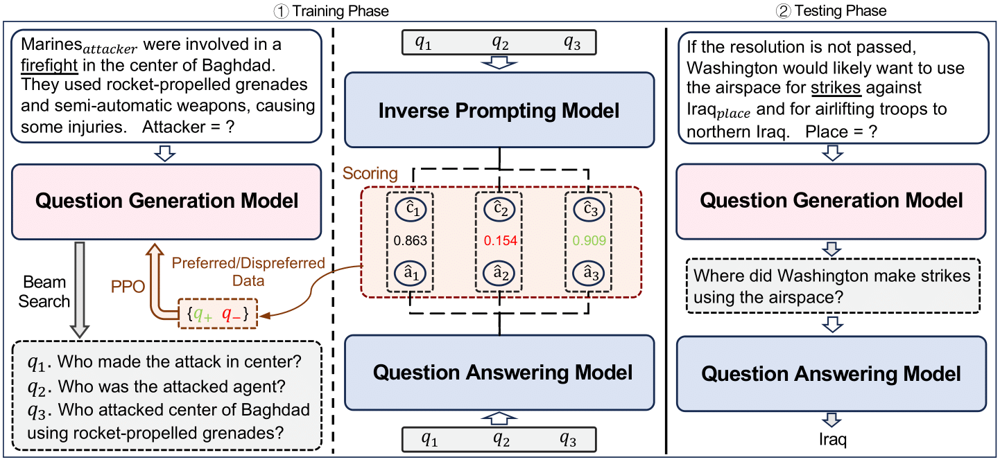

# RLQG - Towards Better QG in QA-based EE

**[2024/08] The video presentation of our paper will be available soon.**

**[2024/08] The presentation of our paper are scheduled at Virtual Poster Session 2, check the poster and slides [here]().**

**[2024/05] Our paper is accepted as a findings paper in ACL2024!**

We propose a novel framework **RLQG** for generating better questions in QA-based event extraction via reinforcement learning, the paper is available [here](https://arxiv.org/abs/2402.11517).



## Setup

### Environment

**The GPU resources we use in our study is 4*A800-SXM4-80G with the corresponding CUDA version 12.1,** we strongly recommend using the torch version above 2.0.

```shell
# Clone the repository
git clone https://github.com/Rcrossmeister/RLQG.git
cd ./RLQG

# Create the conda environment
conda create -n rlqg python=3.11.3
conda activate rlqg

# Install the required packages
pip install -r requirements.txt
python -m spacy download en_core_web_lg
python -m nltk.downloader punkt
```

### Dataset

We use **[ACE2005](https://catalog.ldc.upenn.edu/LDC2006T06)** and **[RAMS](https://nlp.jhu.edu/rams/)** dataset in our study, please follow their copyright to download the required one (ACE2005 with more template options is prefered), another widely-used dataset [WiKiEvent](https://github.com/raspberryice/gen-arg) is planning to support soon. 

**Pre-processing**

Follow **`./ACE2005/README.md`** or **`./RAMS/README.md`** to pre-process the ACE2005 or RAMS dataset accordingly. Data pre-processing is compulsory in our study when you are using raw dataset before getting template questions.

**Teamplate questions for ACE2005**

We support 3 types of template questions for ACE2005 dataset include `standard`, `annotation` and `dynamic`, you can check more details [here](./dataset/ACE2005/ace_templates). **We recommned the `dynamic` template** if there is no additional setting for you, which is also the default setting for the argument `--template_type`.

```shell
python dataset/template_qg.py --template_type dynamic
```

The questions used for supervised fine-tune a QG model and also be used to get beam search implementation will be saved at `./model/data`.

**Teamplate questions for RAMS**

Currently, we only support `standard` template questions in RAMS dataset, see more details [here](./dataset/RAMS/rams_templates). Follw the given template format, you are allowed to support your own question templates. The questions can be directly obtain in the pre-processing step and will be saved at `./model/data`.

### Models

We use [LLaMA-2](https://github.com/meta-llama/llama) as the backbone model in our paper, and we also support several popular open-source LLMs like [ChatGLM](https://github.com/THUDM/ChatGLM-6B) and [Qwen](https://github.com/QwenLM/Qwen). To load the model weight locally, using [LLaMA-2-7b](https://huggingface.co/meta-llama/Llama-2-7b-hf) as an example:

```shell
mkdir backbone_model && cd backbone_model
git lfs install
git clone https://huggingface.co/meta-llama/Llama-2-7b-hf
```

Or you can replace the local path at argument `--model_name_or_path` by the repository name of huggingface (e.g. `meta-llama/Llama-2-7b-hf`) in the following training script, the model weight will be download and load automatically.  

## Training

The training implementaion was inspired by **[LLaMA Factory](https://github.com/hiyouga/LLaMA-Factory)**, you can check their technical report [here](https://arxiv.org/abs/2403.13372). To have better robustness, in this repository, we use DPO training after SFT instead of as refining algorithm. If you're interested in PPO, please refer to the usage [here]() (will be support in this repository soon). 

> \[!TIP\]
> **If you need to use the fine-tuned Inverse Prompting Model (IPM) in our paper, please download `Rcross/IPM-Llama-2-13b` to `./backbone_model` before start.** Notice that we only provides LoRA weights, **please merge them with the backbone model `meta-llama/Llama-2-13b-hf`  before use**. You can also train your customized IPM, please refer [here]() to organize your own training data.

### Quick Start

We provide a script to quick start on ACE2005 dataset, which supervised fine-tune the QG model over the dynamic template questions proposed by [(Lu et al., 2023)](https://arxiv.org/abs/2307.05567), and further refined by the RLQG framework. 

```shell
cd ./model && sh run.sh 
```

> \[!IMPORTANT\]
> **Please download `meta-llama/Llama-2-7b-hf`, `meta-llama/Llama-2-13b-hf` and `meta-llama/Llama-2-13b-chat-hf` to`./backbone_model` before using the quick start script.** The quick start will use the IPM **`Rcross/IPM-Llama-2-13b`** proposed by our paper, and deploy the **`meta-llama/Llama-2-13b-chat-hf`** as the local off-the-shelf QA model with default port `19777`.

### Detailed Workflow

You can check the detailed workflow and more usage in this [README](), which explain each module involved in the quick start script `run.sh`.

## Evaluation

### Question Answering

We support two paradigms to answer the generated questions:

**LLaMA-2 QA**

Using the open-source model such as LLaMA-2 to answer the generated questions with few-shot prompting, the server is deployed follow OpenAI API style. Fill in `[your-url-port]` with the port you use to deploy your local QA model.

```bash
python evaluation/llama2_qa.py \
    --url http://localhost:[your-url-port]/v1/chat/completions \
    --model_name [QA-model-name] \
    --input_dir [path-to-QG-file] \
    --num_shots 5
```

>\[!TIP\]
>We support various open-source model to serve as the QA model in our framework (e.g. ChatGLM and Qwen), and we also support the fine-tuned QA model with LoRA weight to deploy locally. **You can modify the deploying details by following the instructions [here]().**

**OpenAI QA**

Using OpenAI API such as GPT-4 to answer the generated questions with few-shot prompting, you need to prepare an **API key** to support the server. Please find more details in the [OpenAI API platform]().

```shell
python evaluation/openai_qa.py \
    --api_key [your-api-key] \
    --api_model [your-api-model] \
    --input_dir [path-to-QG-file] \
    --num_shots 5 
```

### Response Assessment

```shell
python evaluation/eval.py --input_dir [path-to-QA-file]
```

If you are using the quick start script, you are expected to obtain the experimental results in Table 2 in our paper, looks like follows:

```
============================ Practical Eval ============================
Metric              EM                  COR                 SemSim       
========================================================================
Value(%)          41.47                48.55                68.04        

============================== Full Eval ===============================
Metric              EM                  COR                 SemSim       
========================================================================
Value(%)          21.94                24.31                31.92  
```

## Citation

Please cite our paper if you include RLQG in your work:

```
@article{hong2024towards,
  title={Towards Better Question Generation in QA-based Event Extraction},
  author={Hong, Zijin and Liu, Jian},
  journal={arXiv preprint arXiv:2405.10517},
  year={2024}
}
```
